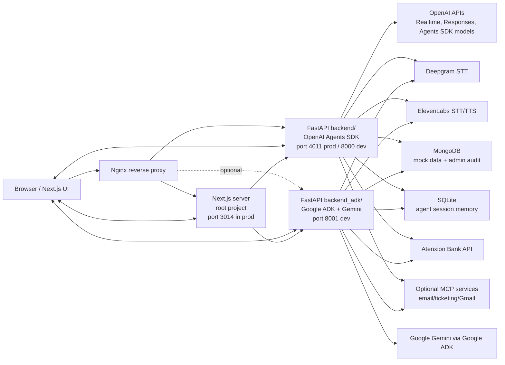
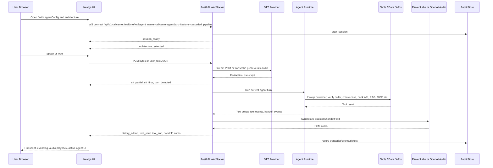
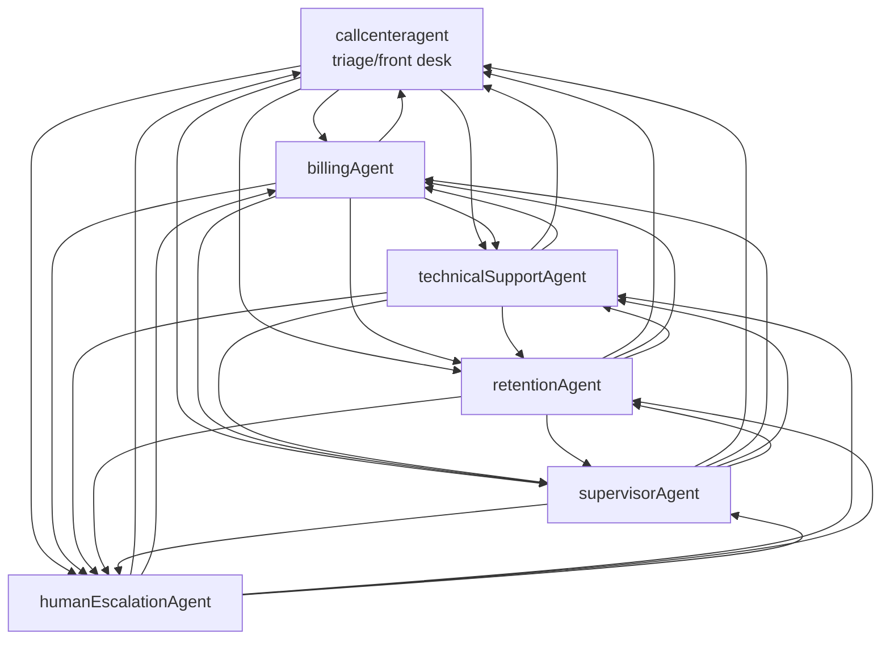

# Atenxion Voice Agent System Architecture and Integration Handoff

This document summarizes the current codebase for integration into a larger production codebase. It covers the Next.js frontend, the OpenAI Agents/FastAPI backend in `backend/`, the Google ADK/FastAPI backend in `backend_adk/`, all public API routes, WebSocket protocol expectations, environment variables, persistence, and deployment notes.

## Executive Summary

The repository is a realtime call-center voice lab for Atenxion support workflows.

- Frontend: Next.js App Router app under `src/app`, served from the repository root.
- Primary backend: FastAPI app under `backend/`, using OpenAI Agents SDK for agent orchestration.
- Alternative backend: FastAPI app under `backend_adk/`, using Google ADK and Gemini for agent orchestration.
- Both backends expose nearly the same route surface so the frontend can switch backends by changing `FRONTEND_BACKEND_BASE_URL` and `NEXT_PUBLIC_CALLCENTER_BACKEND_WS_URL`.
- The main user flow is browser microphone/text input to a backend WebSocket, STT, agent orchestration, tool calls, TTS, and browser playback/transcript/event rendering.
- Production deployment currently expects Next.js on port `3014` and the primary FastAPI backend on port `4011` through PM2 and Nginx.

## Top-Level Repository Map

| Path | Role |
| --- | --- |
| `src/app/` | Next.js frontend, pages, API proxy routes, React hooks, contexts, call-center UI. |
| `src/app/App.tsx` | Main call-center lab UI and session control logic. |
| `src/app/hooks/useBackendRealtimeSession.ts` | Main browser-to-backend WebSocket client, microphone capture, PCM streaming, playback, event handling. |
| `src/app/hooks/useRealtimeSession.ts` | Older/browser OpenAI Realtime WebRTC hook; currently not used by main `App.tsx`. |
| `src/app/api/` | Next.js API routes. Most routes proxy to FastAPI when `FRONTEND_BACKEND_BASE_URL` is set. |
| `backend/` | OpenAI Agents SDK FastAPI backend. |
| `backend/app/api/routes/` | Backend HTTP and WebSocket routes. |
| `backend/app/agents/callcenter/` | OpenAI agent graph, prompts, tools, data repository, realtime runtimes, stress lab. |
| `backend_adk/` | Google ADK sibling backend. |
| `backend_adk/app/api/routes/` | ADK backend HTTP and WebSocket routes, route-compatible with `backend/`. |
| `backend_adk/app/agents/callcenter/` | ADK agent graph, tools, runner, cascaded runtime, stress lab. |
| `ecosystem.config.cjs` | PM2 production process file for frontend and primary backend. |
| `.env.sample` | Environment variable reference. |
| `docs/` | Project documentation and this integration handoff. |

## Runtime Topology



## Main Voice Flow



## Frontend Architecture

### Framework and Runtime

- Framework: Next.js 15 App Router.
- React: React 19.
- Styling: Tailwind CSS.
- Icons: Radix UI icons.
- Production process: `node_modules/next/dist/bin/next start -p 3014 -H 0.0.0.0`.
- Build command: `npm run build`.

### Frontend Pages

| URL | File | Purpose |
| --- | --- | --- |
| `/` | `src/app/page.tsx`, `src/app/App.tsx` | Main realtime call-center lab. |
| `/admin` | `src/app/admin/page.tsx` | Admin session review board backed by `/api/admin/sessions`. |
| `/stress-lab` | `src/app/stress-lab/page.tsx` | Latency and tool stress benchmark UI. |

### Main Frontend State

`src/app/App.tsx` owns:

- Selected scenario via `agentConfig` query parameter.
- Selected voice architecture via `architecture` query parameter.
- Selected active agent.
- Session status.
- Mic enabled/disabled state.
- Audio playback enabled/disabled state.
- Filler/transfer sounds.
- Event panel visibility.
- User text input.

Important query parameters:

| Query param | Example | Meaning |
| --- | --- | --- |
| `agentConfig` | `callcenteragent` or default key | Selects frontend agent config set. |
| `architecture` | `cascaded_pipeline` | Selects backend runtime architecture. |
| `codec` | `opus` | Used by older WebRTC hook and toolbar codec selector. |

### Frontend Contexts

| File | Role |
| --- | --- |
| `src/app/contexts/TranscriptContext.tsx` | Stores transcript messages, transcript updates, and breadcrumbs. |
| `src/app/contexts/EventContext.tsx` | Stores client/server events for the event log. |

### Main WebSocket Hook

`src/app/hooks/useBackendRealtimeSession.ts` is the active runtime client used by `App.tsx`.

Responsibilities:

- Builds backend WS URL from environment.
- Opens WebSocket to `/api/v1/callcenter/realtime/ws`.
- Captures microphone with `navigator.mediaDevices.getUserMedia`.
- Resamples mic audio to backend input sample rate.
- Converts Float32 mic frames to PCM16 bytes.
- Applies local speech gate and push-to-talk control.
- Sends PCM bytes, `user_text`, `client_event`, `audio_commit`, `interrupt`, and `ping` messages.
- Receives server JSON events.
- Converts base64 PCM audio responses into browser `AudioBuffer` playback.
- Handles barge-in by stopping local playback and sending `interrupt`.
- Updates transcript/event contexts.
- Emits UI callbacks for handoffs, tool start/end, transfer audio, assistant speech, and connection status.

Architecture-specific client audio behavior:

| Architecture | Input sample rate | Client behavior |
| --- | ---: | --- |
| `cascaded_pipeline` | 24000 Hz | Browser streams PCM16 to backend; local speech gate commits turns. |
| `elevenlabs_pipeline` | 16000 Hz | Browser streams PCM16 suitable for ElevenLabs Scribe; provider VAD mode is enabled. |
| `openai_native` | 24000 Hz-ish PCM path through backend runtime | Only available in the OpenAI backend. The ADK backend rejects this architecture. |

### Legacy/OpenAI Browser WebRTC Hook

`src/app/hooks/useRealtimeSession.ts` uses `@openai/agents/realtime` and browser WebRTC directly with an ephemeral OpenAI key from `/api/session`.

The current `App.tsx` uses `useBackendRealtimeSession`, not this hook. Keep this hook only if the production app still needs a browser-owned OpenAI Realtime path.

## Frontend API Routes

The Next.js API routes provide a stable browser-facing route surface. When `FRONTEND_BACKEND_BASE_URL` is configured, routes proxy to FastAPI through `src/app/api/_lib/backendProxy.ts`.

`backendProxy.ts` behavior:

- Reads `FRONTEND_BACKEND_BASE_URL`.
- Removes trailing slashes.
- Adds `Content-Type: application/json`.
- Uses `cache: no-store`.
- Applies a 90 second timeout.
- Returns the FastAPI response body/status/content type.

| Frontend route | File | Method | FastAPI target when proxy configured | Fallback behavior |
| --- | --- | --- | --- | --- |
| `/api/health` | `src/app/api/health/route.ts` | GET | `/api/health` | Local Next.js health JSON. |
| `/api/session` | `src/app/api/session/route.ts` | GET | `/api/session` | Calls OpenAI realtime sessions directly using `OPENAI_API_KEY`. |
| `/api/responses` | `src/app/api/responses/route.ts` | POST | `/api/responses` | Calls OpenAI Responses API directly using `OPENAI_API_KEY`. |
| `/api/admin/sessions?limit=N` | `src/app/api/admin/sessions/route.ts` | GET | `/api/v1/callcenter/admin/sessions?limit=N` | Returns empty session list. |
| `/api/admin/sessions/{sessionId}` | `src/app/api/admin/sessions/[sessionId]/route.ts` | GET | `/api/v1/callcenter/admin/sessions/{sessionId}` | Returns 404. |
| `/api/stress-lab/scenarios` | `src/app/api/stress-lab/scenarios/route.ts` | GET | `/api/v1/callcenter/stress-lab/scenarios` | Returns disabled empty scenario list. |
| `/api/stress-lab/runs` | `src/app/api/stress-lab/runs/route.ts` | POST | `/api/v1/callcenter/stress-lab/runs` | Returns 503. |
| `/api/stress-lab/runs/{runId}` | `src/app/api/stress-lab/runs/[runId]/route.ts` | GET | `/api/v1/callcenter/stress-lab/runs/{runId}` | Returns 404. |

## Backend Route Surface

Both `backend/` and `backend_adk/` mount routes through `app/api/router.py`.

### Shared HTTP Routes

| Backend route | Method | Purpose | Used by frontend |
| --- | --- | --- | --- |
| `/api/health` | GET | Health, uptime, service metadata, available architectures. | Yes, through `/api/health`. |
| `/api/session` | GET | Compatibility route for OpenAI native realtime sessions. | Only legacy browser WebRTC path. |
| `/api/responses` | POST | Backend-held OpenAI Responses API proxy. | Yes, if frontend features call `/api/responses`. |
| `/api/v1/callcenter/scenario` | GET | Static scenario metadata: company, agents, tools, available architectures. | Not currently proxied by a Next API route, but useful for integration. |
| `/api/v1/callcenter/seed` | POST | Seed demo mock data into MongoDB. | Manual/admin/dev use. |
| `/api/v1/callcenter/sessions/{session_id}/events` | POST | Persist client-originated audit event. | WebSocket runtime mostly records events; route is available for external clients. |
| `/api/v1/callcenter/admin/sessions?limit=N` | GET | List recent admin/audit sessions. | Yes, `/admin`. |
| `/api/v1/callcenter/admin/sessions/{session_id}` | GET | Session detail including tickets, transcript, events. | Yes, `/admin`. |
| `/api/v1/callcenter/run` | POST | Text-only one-turn call-center agent execution. | Not used by main UI, useful for tests/integration. |
| `/api/v1/callcenter/stress-lab/scenarios` | GET | List benchmark scenarios. | Yes, `/stress-lab`. |
| `/api/v1/callcenter/stress-lab/runs` | POST | Execute stress-lab suite. | Yes, `/stress-lab`. |
| `/api/v1/callcenter/stress-lab/runs/{run_id}` | GET | Fetch persisted stress-lab run. | Yes, route exists in frontend. |

### Shared WebSocket Route

| Backend route | Method | Purpose |
| --- | --- | --- |
| `/api/v1/callcenter/realtime/ws?agent_name={agentName}&architecture={architecture}` | WS | Main realtime voice/text runtime. Browser sends PCM bytes and JSON control messages; backend sends JSON events and base64 PCM audio chunks. |

### Text Run Request and Response

Route: `POST /api/v1/callcenter/run`

Request:

```json
{
  "input_text": "I need help with my bill",
  "session_id": "optional-stable-session-id"
}
```

Response:

```json
{
  "session_id": "callcenter-...",
  "final_output": "assistant final response",
  "trace": {
    "trace_id": "...",
    "verified": false,
    "active_account_id": null,
    "case_id": null,
    "case_notes": []
  }
}
```

## OpenAI Backend Architecture (`backend/`)

### FastAPI App

| File | Role |
| --- | --- |
| `backend/app/main.py` | Creates FastAPI app, configures CORS, request IDs, logging, and mounts routers. |
| `backend/app/core/config.py` | Pydantic settings loaded from root `.env`, `backend/.env`, or runtime `.env`. |
| `backend/app/api/router.py` | Includes health, session, responses, callcenter, stress-lab routers. |

### OpenAI Backend Runtime Modes

| Architecture | Implementation | Providers |
| --- | --- | --- |
| `openai_native` | `backend/app/agents/callcenter/realtime_runtime.py` | OpenAI Realtime Agents SDK for LLM, STT, TTS/audio. |
| `cascaded_pipeline` | `backend/app/agents/callcenter/cascaded/runtime.py` | Deepgram STT -> OpenAI Agents SDK / OpenAI LLM -> ElevenLabs TTS. |
| `elevenlabs_pipeline` | `backend/app/agents/callcenter/cascaded/runtime.py` | ElevenLabs Scribe STT -> OpenAI Agents SDK / OpenAI LLM -> ElevenLabs TTS. |

Important behavior in `backend/app/api/routes/callcenter.py`:

- `architecture` comes from the WebSocket query parameter or `VOICE_PROVIDER`.
- If `architecture == "openai_native"` and `VOICE_PROVIDER == "openai_native"`, code currently forces `architecture = "cascaded_pipeline"`. Check this before production migration if true native realtime is required.
- Cascaded architectures use `CallCenterCascadedRuntime`.
- Otherwise the backend uses `CallCenterRealtimeRuntime`.

### OpenAI Agent Graph

| File | Role |
| --- | --- |
| `backend/app/agents/callcenter/graph.py` | Builds OpenAI Agents SDK `Agent` objects and handoffs. |
| `backend/app/agents/callcenter/realtime_graph.py` | Builds realtime agent graph for OpenAI native realtime sessions. |
| `backend/app/agents/callcenter/prompts.py` | Specialist prompt definitions. |
| `backend/app/agents/callcenter/tools.py` | Tool functions used by agents. |
| `backend/app/agents/callcenter/context.py` | Shared per-session context: verification, active account, case, notes, agent state. |
| `backend/app/agents/callcenter/runner.py` | Text-only OpenAI Agents SDK runner with SQLite session memory. |

Agent names:

- `callcenteragent`: triage/front desk.
- `billingAgent`: billing, latest bill, bank transactions, charges, credits.
- `technicalSupportAgent`: outages, diagnostics, technician scheduling.
- `retentionAgent`: plans, comparison, retention offers, cancellation.
- `supervisorAgent`: policy, exceptions, escalations, RAG/MCP tools.
- `humanEscalationAgent`: simulated live escalation and human handoff messaging.

Agent graph shape:



### OpenAI Backend Tool Inventory

Shared/account tools:

- `lookup_customer_profile`
- `verify_caller`
- `lookup_active_services`
- `create_case`
- `add_case_note`

Billing tools:

- `get_latest_bill`
- `atenxion_bank_tool`
- `explain_charge_breakdown`
- `offer_payment_arrangement`
- `apply_goodwill_credit`

Technical support tools:

- `check_service_outage`
- `run_line_diagnostics`
- `schedule_technician`
- `reboot_device_workflow`

Retention tools:

- `lookup_plan_options`
- `compare_plans`
- `generate_retention_offer`
- `submit_cancellation_request`

Supervisor and knowledge tools:

- `lookup_policy_document`
- `search_atenxion_knowledge_base`
- `approve_exception`
- `escalation_decision`

MCP workflow tools:

- `search_gmail_customer_history`
- `send_customer_followup_email_via_mcp`
- `search_customer_tickets_via_mcp`
- `create_customer_ticket_via_mcp`

External API:

- `atenxion_bank_tool`, configured by `ATENXION_BANK_API_BASE_URL`, `ATENXION_BANK_API_TOKEN`, and `ATENXION_BANK_TEST_USER_ID`.

### OpenAI Cascaded Runtime

File: `backend/app/agents/callcenter/cascaded/runtime.py`

Responsibilities:

- Owns one WebSocket session lifetime.
- Starts Deepgram or ElevenLabs Scribe transcriber when credentials exist.
- Starts ElevenLabs TTS adapter when `ELEVENLABS_API_KEY` exists.
- Creates SQLite-backed OpenAI Agents session.
- Tracks active call-center context.
- Handles browser PCM bytes and JSON control messages.
- Converts STT final transcripts to agent turns.
- Streams OpenAI Agents SDK events.
- Emits frontend-normalized events.
- Buffers sentence chunks for TTS.
- Handles deterministic/direct handoff routing for common requests.
- Emits transfer outro/intro audio windows.
- Creates/admin-audits transcript, events, and outcome tickets.

### OpenAI Native Runtime

File: `backend/app/agents/callcenter/realtime_runtime.py`

Responsibilities:

- Bridges browser WebSocket messages to `agents.realtime.RealtimeRunner`.
- Sends PCM bytes to OpenAI native realtime session.
- Sends text, interrupt, audio commit, and supported session updates.
- Normalizes OpenAI realtime events into frontend JSON events.
- Uses OpenAI realtime model from `OPENAI_REALTIME_MODEL`.
- Uses output audio modality with PCM16 and voice `sage`.

## Google ADK Backend Architecture (`backend_adk/`)

The ADK backend is intentionally a sibling implementation. It keeps the same FastAPI route shape and frontend WebSocket protocol, but the LLM agent orchestration uses Google ADK and Gemini.

### FastAPI App

| File | Role |
| --- | --- |
| `backend_adk/app/main.py` | Same FastAPI setup pattern as primary backend. |
| `backend_adk/app/core/config.py` | ADK-oriented settings including `GOOGLE_API_KEY`, `GOOGLE_ADK_MODEL`, and `ADK_SESSION_DB_PATH`. |
| `backend_adk/app/api/router.py` | Includes the same route groups as the primary backend. |

### ADK Runtime Modes

| Architecture | Implementation | Providers |
| --- | --- | --- |
| `cascaded_pipeline` | `backend_adk/app/agents/callcenter/cascaded/runtime.py` | Deepgram STT -> Google ADK/Gemini -> ElevenLabs TTS. |
| `elevenlabs_pipeline` | `backend_adk/app/agents/callcenter/cascaded/runtime.py` | ElevenLabs Scribe STT -> Google ADK/Gemini -> ElevenLabs TTS. |
| `openai_native` | Not supported | The ADK backend returns an error and closes the WebSocket. |

### ADK Agent Graph

| File | Role |
| --- | --- |
| `backend_adk/app/agents/callcenter/graph.py` | Builds Google ADK `LlmAgent` graph. |
| `backend_adk/app/agents/callcenter/runner.py` | Wraps ADK `Runner`, `DatabaseSessionService`, session state mapping, and text turns. |
| `backend_adk/app/agents/callcenter/tools.py` | ADK-compatible tool functions using `ToolContext` state. |
| `backend_adk/app/agents/callcenter/cascaded/runtime.py` | Cascaded voice runtime using ADK events instead of OpenAI Agents SDK events. |

ADK implementation notes:

- Root agent is `callcenteragent`.
- Specialist agents are passed as `sub_agents` of the root ADK `LlmAgent`.
- Handoff is instructed through ADK transfer actions such as `transfer_to_agent`.
- `CallCenterAdkEngine` owns a Google ADK `Runner` and `DatabaseSessionService`.
- ADK session state maps to local `CallCenterContext` with fields like `verified`, `current_agent_name`, `active_account_id`, `case_id`, and `case_notes`.
- `GOOGLE_API_KEY` is required for ADK/Gemini turns.
- The ADK backend can still expose `/api/responses` if `OPENAI_API_KEY` is configured, but call-center orchestration itself uses Google ADK.

### ADK Route Differences

| Route | Difference from OpenAI backend |
| --- | --- |
| `/api/health` | Returns `service: atenxion-callcenter-adk-backend`, `llm_provider: google_adk`, and `llm_model`. |
| `/api/session` | Compatibility response for cascaded sessions; returns 501 if native realtime is requested. |
| `/api/responses` | Requires optional `OPENAI_API_KEY`; otherwise returns 503. |
| `/api/v1/callcenter/scenario` | Lists only `cascaded_pipeline` and `elevenlabs_pipeline`, with `google_adk` as LLM provider. |
| `/api/v1/callcenter/realtime/ws` | Rejects `openai_native`; supports only cascaded architectures. |

## WebSocket Protocol

Route:

```text
WS /api/v1/callcenter/realtime/ws?agent_name=callcenteragent&architecture=cascaded_pipeline
```

Supported `architecture` values:

| Backend | Values |
| --- | --- |
| `backend/` | `openai_native`, `cascaded_pipeline`, `elevenlabs_pipeline` |
| `backend_adk/` | `cascaded_pipeline`, `elevenlabs_pipeline` |

Supported `agent_name` values:

- `callcenteragent`
- `billingAgent`
- `technicalSupportAgent`
- `retentionAgent`
- `supervisorAgent`
- `humanEscalationAgent`

### Browser to Backend Messages

Binary messages:

- Raw PCM16 audio bytes.
- For `cascaded_pipeline`, frontend targets 24000 Hz mono PCM16.
- For `elevenlabs_pipeline`, frontend targets 16000 Hz mono PCM16.

JSON messages:

```json
{ "type": "user_text", "text": "I need help with billing" }
```

```json
{ "type": "interrupt", "reason": "barge_in" }
```

```json
{ "type": "audio_commit" }
```

```json
{ "type": "ping" }
```

```json
{
  "type": "client_event",
  "event": {
    "type": "speech_gate.open",
    "session_id": "callcenter-cascaded-...",
    "payload": {
      "type": "speech_gate.open",
      "noiseFloor": 0.01,
      "speechThreshold": 0.05
    }
  }
}
```

Other client event payloads used by the frontend:

- `session.update`
- `input_audio_buffer.clear`
- `input_audio_buffer.commit`
- `conversation.item.create`
- `speech_gate.open`
- `speech_gate.closed`

### Backend to Browser Events

Common event types consumed by `useBackendRealtimeSession.ts`:

| Event type | Meaning |
| --- | --- |
| `session_ready` | Runtime accepted WebSocket and created session/trace. |
| `architecture_selected` | Backend selected STT/LLM/TTS provider/model set. |
| `stt_stream_ready` | STT provider websocket/session is ready. |
| `stt_audio_received` | Backend received first mic audio bytes for turn. |
| `stt_partial` | Partial transcript from STT provider. |
| `stt_final` | Final transcript from STT provider. |
| `turn_detected` | Backend accepted a user turn for agent processing. |
| `metrics_update` | Latency/usage/provider metrics for a turn. |
| `cost_estimate` | Cost estimate event, if generated by backend. |
| `history_added` | Conversation item added. |
| `history_updated` | Conversation history updated. |
| `handoff` | Active agent changed. |
| `transfer_audio_start` | UI should play transfer/ringing filler cue. |
| `transfer_audio_end` | Transfer window ended server-side. |
| `agent_speech_start` | Agent speech started. |
| `agent_speech_end` | Agent speech ended. |
| `tool_start` | Agent tool call started. |
| `tool_end` | Agent tool call ended. |
| `audio` | Base64 PCM16 audio chunk for playback. |
| `audio_end` | Current audio output ended. |
| `audio_interrupted` | Backend canceled/cleared assistant audio. |
| `guardrail_tripped` | Guardrail event. |
| `ticket_created` | Admin/outcome ticket was created. |
| `error` | Runtime error event. |
| `pong` | Response to ping. |

Example `session_ready`:

```json
{
  "type": "session_ready",
  "session_id": "callcenter-cascaded-...",
  "trace_id": "...",
  "agent_name": "callcenteragent",
  "architecture": "cascaded_pipeline",
  "timestamp": "2026-06-02T00:00:00+00:00"
}
```

Example `audio`:

```json
{
  "type": "audio",
  "data": "base64-pcm16-audio",
  "agent_name": "billingAgent"
}
```

## Persistence and Data Stores

### SQLite

| Backend | Setting | Default | Purpose |
| --- | --- | --- | --- |
| `backend/` | `CALLCENTER_SESSION_DB_PATH` | `backend/.data/callcenter_sessions.db` | OpenAI Agents SDK `SQLiteSession` memory. |
| `backend_adk/` | `ADK_SESSION_DB_PATH` | `backend_adk/.data/callcenter_sessions.db` | Google ADK `DatabaseSessionService`. |
| `backend_adk/` | `CALLCENTER_SESSION_DB_PATH` | `backend_adk/.data/callcenter_sessions.db` | Compatibility path used by shared components. |

### MongoDB

Settings:

- `MONGODB_URI`
- `MONGODB_DB`

Used by:

- `CallCenterDataRepository` for seedable mock data.
- `SessionAuditLogger` for session records, events, transcripts, and tickets.
- `/admin` UI through `/api/admin/sessions`.

If MongoDB is not available, repository methods fall back to static mock data where possible, and admin audit features may be empty/offline.

### File/JSON Data

| Setting | Default | Purpose |
| --- | --- | --- |
| `STRESS_LAB_RESULTS_PATH` | `backend/.data/stress_lab_runs.json` | Persist stress lab run results. |
| `CALLCENTER_RAG_VECTOR_STORE_ID` | none | Optional OpenAI vector store ID for call-center RAG. |
| `STRESS_LAB_VECTOR_STORE_ID` | none | Optional OpenAI vector store ID for stress-lab RAG scenarios. |

## Environment Variables

### Frontend / Next.js

| Variable | Required | Purpose |
| --- | --- | --- |
| `FRONTEND_BACKEND_BASE_URL` | Production yes | Server-side Next API proxy target, for example `http://127.0.0.1:4011` or `https://api-demovoice.atenxion.ai`. |
| `NEXT_PUBLIC_FRONTEND_BACKEND_BASE_URL` | Browser yes | Browser-visible backend base for deriving WebSocket URL. Must be present at `npm run build` time. |
| `NEXT_PUBLIC_CALLCENTER_BACKEND_WS_URL` | Browser yes | Explicit browser WebSocket URL, for example `wss://api-demovoice.atenxion.ai/api/v1/callcenter/realtime/ws`. Must be present at build time. |
| `OPENAI_API_KEY` | Optional in frontend server | Used only by fallback Next `/api/session` and `/api/responses` when no FastAPI proxy is configured. |

Important Next.js note:

`NEXT_PUBLIC_*` values are bundled into client code during `npm run build`. If they change in production, rebuild the frontend and restart PM2.

### OpenAI Backend

| Variable | Required | Purpose |
| --- | --- | --- |
| `OPENAI_API_KEY` | Yes | OpenAI Agents, OpenAI Realtime, Responses proxy, vector search helpers. |
| `BACKEND_PORT` | No | Backend port metadata, default `8000`; PM2 runs `4011`. |
| `BACKEND_BASE_URL` | No | Backend self/base URL. |
| `FRONTEND_BACKEND_BASE_URL` | No | Compatibility value. |
| `ALLOWED_ORIGINS` | Production yes | Comma-separated CORS origins. |
| `LOG_LEVEL` | No | Logging level. |
| `VOICE_PROVIDER` | No | Default backend voice architecture. |
| `OPENAI_REALTIME_MODEL` | No | OpenAI native realtime model. |
| `OPENAI_RESPONSES_MODEL` | No | Text run/OpenAI Agents model. |
| `OPENAI_CASCADED_LLM_MODEL` | No | Cascaded OpenAI LLM model. |
| `DEEPGRAM_API_KEY` | Required for Deepgram path | Deepgram realtime STT. |
| `ELEVENLABS_API_KEY` | Required for ElevenLabs STT/TTS | ElevenLabs Scribe STT and TTS. |
| `MONGODB_URI` | Optional | MongoDB connection. |
| `MONGODB_DB` | Optional | MongoDB database name. |
| `ATENXION_BANK_API_BASE_URL` | Optional | External bank API base URL. |
| `ATENXION_BANK_API_TOKEN` | Optional | External bank API token. |
| `CALLCENTER_RAG_VECTOR_STORE_ID` | Optional | OpenAI vector store for RAG. |
| `MCP_*` variables | Optional | Gmail/email/ticketing MCP tools. |

### Google ADK Backend

| Variable | Required | Purpose |
| --- | --- | --- |
| `GOOGLE_API_KEY` | Yes | Gemini/Google ADK model access. |
| `GOOGLE_ADK_MODEL` | No | ADK model, default `gemini-2.5-flash`. |
| `BACKEND_ADK_PORT` | No | ADK backend port metadata, default `8001`. |
| `BACKEND_ADK_BASE_URL` | No | ADK backend base URL. |
| `ADK_SESSION_DB_PATH` | No | ADK SQLite session DB path. |
| `VOICE_PROVIDER` | No | Should be `cascaded_pipeline` or `elevenlabs_pipeline`. |
| `OPENAI_API_KEY` | Optional | Only for optional `/api/responses` and OpenAI helper tools. |
| `DEEPGRAM_API_KEY` | Required for Deepgram path | Deepgram realtime STT. |
| `ELEVENLABS_API_KEY` | Required for ElevenLabs STT/TTS | ElevenLabs Scribe STT and TTS. |
| `MONGODB_URI` / `MONGODB_DB` | Optional | Admin audit and mock data. |
| `ATENXION_BANK_*` | Optional | External bank API. |
| `MCP_*` variables | Optional | Gmail/email/ticketing MCP tools. |

## Deployment Architecture

Current PM2 production file: `ecosystem.config.cjs`.

### PM2 Apps

| PM2 name | CWD | Command | Port |
| --- | --- | --- | --- |
| `voice backend` | repo root | `uv run --project backend uvicorn app.main:app --app-dir backend --host 0.0.0.0 --port 4011 --proxy-headers` | 4011 |
| `voice frontend` | repo root | `node node_modules/next/dist/bin/next start -p 3014 -H 0.0.0.0` | 3014 |

The PM2 config currently starts only the OpenAI backend. To deploy the ADK backend, add a sibling PM2 app using:

```bash
uv run --project backend_adk uvicorn app.main:app --app-dir backend_adk --host 0.0.0.0 --port <ADK_PORT> --proxy-headers
```

### Typical Server Commands

```bash
git clone <repo>
cd openai-realtime-agents
npm ci
uv sync --project backend
npm run build
pm2 startOrReload ecosystem.config.cjs --update-env
pm2 save
```

For ADK:

```bash
uv sync --project backend_adk
uv run --project backend_adk uvicorn app.main:app --app-dir backend_adk --host 127.0.0.1 --port 8001 --reload
```

### Nginx Requirements

Frontend:

- Proxy domain to `http://127.0.0.1:3014`.

Backend API:

- Proxy API domain to `http://127.0.0.1:4011` for OpenAI backend or ADK port for ADK backend.
- WebSocket upgrade headers are required for `/api/v1/callcenter/realtime/ws`.

Example WebSocket-safe proxy block:

```nginx
location / {
  proxy_pass http://127.0.0.1:4011;
  proxy_http_version 1.1;
  proxy_set_header Upgrade $http_upgrade;
  proxy_set_header Connection "upgrade";
  proxy_set_header Host $host;
  proxy_set_header X-Real-IP $remote_addr;
  proxy_set_header X-Forwarded-For $proxy_add_x_forwarded_for;
  proxy_set_header X-Forwarded-Proto $scheme;
}
```

Production HTTPS requires browser WebSocket URL to use `wss://`, not `ws://`.

## Integration Options

### Option A: Keep Frontend API Proxy Pattern

Production frontend calls local `/api/*` routes. Next.js proxies to the selected backend using `FRONTEND_BACKEND_BASE_URL`.

Pros:

- Browser never needs direct HTTP API base except WebSocket.
- Stable frontend route surface.
- Server-side API proxy can hide backend host changes.

Cons:

- WebSocket still needs a browser-visible `NEXT_PUBLIC_CALLCENTER_BACKEND_WS_URL`.
- Next server is in the request path for REST APIs.

### Option B: Direct Browser to Backend API

Refactor frontend pages to call backend API domain directly.

Pros:

- Less proxy code in Next.js.
- Easier to split frontend/backend services.

Cons:

- CORS and auth must be production-grade.
- More browser-visible backend configuration.

### Option C: Embed Backend Routes into Main Production API

Move FastAPI route modules and agent packages into the main production backend.

Recommended migration units:

1. Copy config model concepts from `app/core/config.py`.
2. Mount equivalent routes from `app/api/routes`.
3. Copy `app/agents/callcenter`.
4. Preserve WebSocket protocol used by `useBackendRealtimeSession.ts`.
5. Preserve admin/audit persistence schema or adapt `/admin` frontend.
6. Add production auth, rate limiting, and tenant/account binding around all routes.

## Production Integration Checklist

### Frontend

- Keep or replace `useBackendRealtimeSession.ts`.
- Preserve WebSocket event names unless refactoring backend and frontend together.
- Ensure `NEXT_PUBLIC_CALLCENTER_BACKEND_WS_URL` points to production backend WS.
- Ensure `NEXT_PUBLIC_FRONTEND_BACKEND_BASE_URL` is set before `npm run build`.
- Decide whether `src/app/api/*` proxy routes remain or are replaced by direct API calls.
- Add production authentication around `/admin` and stress-lab routes before exposing publicly.

### Backend

- Decide primary orchestration backend: OpenAI Agents SDK, Google ADK, or both.
- Keep route compatibility if frontend should switch between backends.
- Ensure WebSocket reverse proxy supports upgrade headers.
- Set `ALLOWED_ORIGINS` to production frontend domains.
- Configure API keys for selected architecture.
- Configure MongoDB if admin sessions and seedable data are required.
- Configure SQLite path to persistent disk.
- Decide whether optional MCP tools are enabled.
- Decide whether Atenxion Bank API should use real production credentials or a QA endpoint.

### Security

- Do not expose `OPENAI_API_KEY`, `GOOGLE_API_KEY`, `DEEPGRAM_API_KEY`, `ELEVENLABS_API_KEY`, `ATENXION_BANK_API_TOKEN`, or MCP auth tokens to the browser.
- Treat `NEXT_PUBLIC_*` variables as public.
- Add auth to admin session routes.
- Add auth/rate limits to `/api/v1/callcenter/realtime/ws`.
- Add request/body size limits for WebSocket and API routes.
- Review whether session transcripts can contain PII before persisting to MongoDB.
- Review CORS origins and Nginx host rules.

## Key Files for an Integration Agent

Read these first:

1. `src/app/App.tsx`
2. `src/app/hooks/useBackendRealtimeSession.ts`
3. `src/app/api/_lib/backendProxy.ts`
4. `backend/app/api/routes/callcenter.py`
5. `backend/app/agents/callcenter/cascaded/runtime.py`
6. `backend/app/agents/callcenter/graph.py`
7. `backend/app/agents/callcenter/tools.py`
8. `backend/app/agents/callcenter/session_audit.py`
9. `backend_adk/app/api/routes/callcenter.py`
10. `backend_adk/app/agents/callcenter/runner.py`
11. `backend_adk/app/agents/callcenter/cascaded/runtime.py`
12. `ecosystem.config.cjs`

## Route Compatibility Matrix

| Capability | Frontend route | OpenAI backend | ADK backend |
| --- | --- | --- | --- |
| Health | `/api/health` | `/api/health` | `/api/health` |
| OpenAI realtime session compatibility | `/api/session` | `/api/session` creates OpenAI session | `/api/session` returns cascaded compatibility message or 501 |
| Responses API proxy | `/api/responses` | `/api/responses` requires `OPENAI_API_KEY` | `/api/responses` optional, requires `OPENAI_API_KEY` |
| Scenario metadata | none currently | `/api/v1/callcenter/scenario` | `/api/v1/callcenter/scenario` |
| Text turn | none currently | `/api/v1/callcenter/run` | `/api/v1/callcenter/run` |
| Realtime WS | direct browser WS | `/api/v1/callcenter/realtime/ws` | `/api/v1/callcenter/realtime/ws` |
| Seed mock data | none currently | `/api/v1/callcenter/seed` | `/api/v1/callcenter/seed` |
| Record session event | none currently | `/api/v1/callcenter/sessions/{session_id}/events` | `/api/v1/callcenter/sessions/{session_id}/events` |
| Admin list | `/api/admin/sessions` | `/api/v1/callcenter/admin/sessions` | `/api/v1/callcenter/admin/sessions` |
| Admin detail | `/api/admin/sessions/{sessionId}` | `/api/v1/callcenter/admin/sessions/{session_id}` | `/api/v1/callcenter/admin/sessions/{session_id}` |
| Stress scenarios | `/api/stress-lab/scenarios` | `/api/v1/callcenter/stress-lab/scenarios` | `/api/v1/callcenter/stress-lab/scenarios` |
| Stress run | `/api/stress-lab/runs` | `/api/v1/callcenter/stress-lab/runs` | `/api/v1/callcenter/stress-lab/runs` |
| Stress run detail | `/api/stress-lab/runs/{runId}` | `/api/v1/callcenter/stress-lab/runs/{run_id}` | `/api/v1/callcenter/stress-lab/runs/{run_id}` |

## Known Integration Notes and Risks

- `backend/` and `backend_adk/` intentionally duplicate many files. If integrating into production, choose whether to preserve duplication for provider isolation or abstract shared code carefully.
- The frontend's active path is backend WebSocket based. The older browser OpenAI Realtime WebRTC hook remains but is not the active main path.
- The ADK backend does not implement OpenAI native realtime. Do not route `architecture=openai_native` to `backend_adk`.
- `NEXT_PUBLIC_*` values must be configured before building the frontend.
- WebSocket audio is raw PCM16 binary frames plus JSON control messages. Any production API gateway must allow binary WebSocket frames.
- MongoDB is optional for demo fallback, but `/admin` is useful only when audit records are persisted.
- Stress-lab routes can call real external APIs/OpenAI tools when enabled. Keep them disabled or auth-protected in production.
- The bank tool currently defaults to a QA base URL. Production integration should explicitly configure the correct endpoint and credentials.
- Admin console has no app-level auth in this repo.
- CORS is environment-driven; production must set strict `ALLOWED_ORIGINS`.
